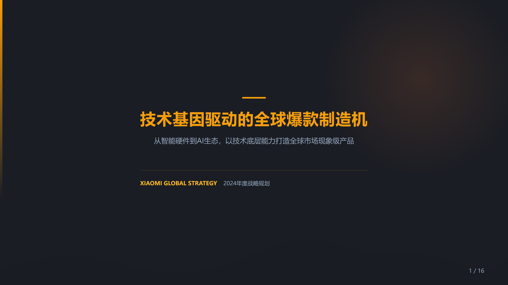
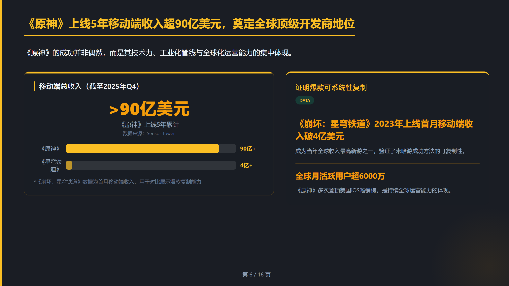
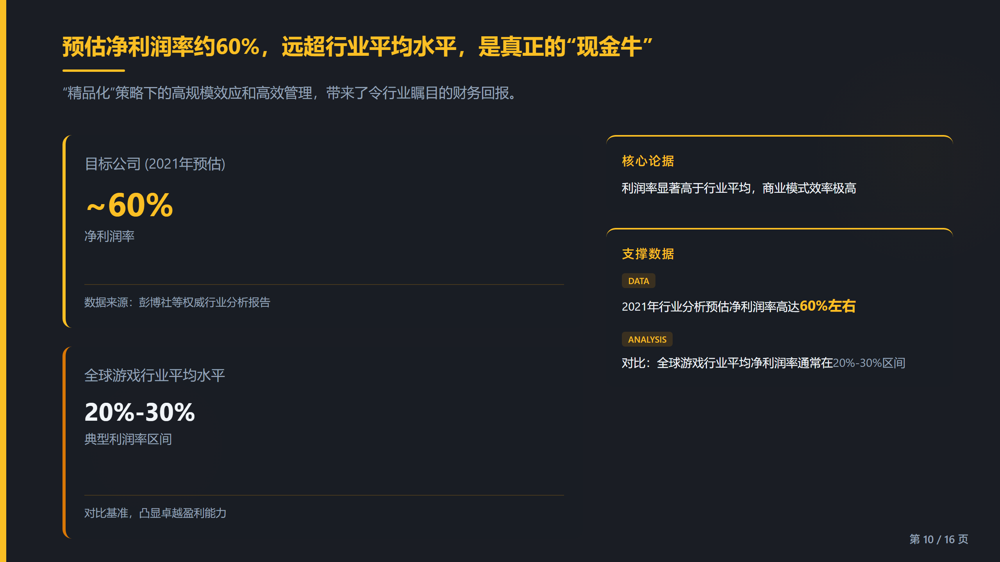
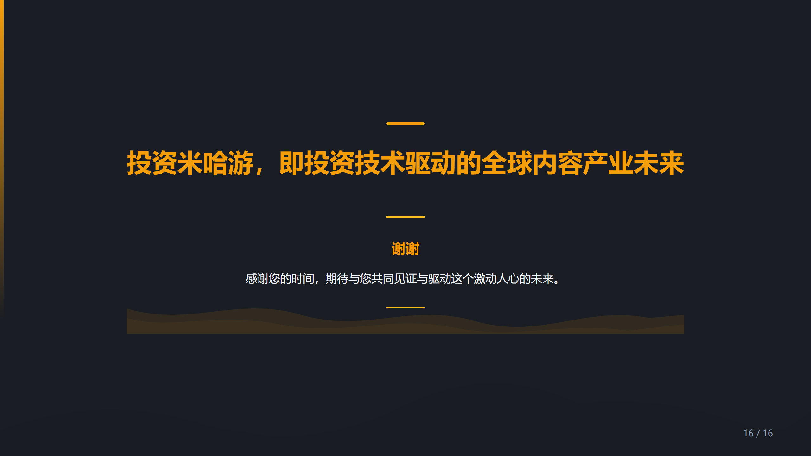
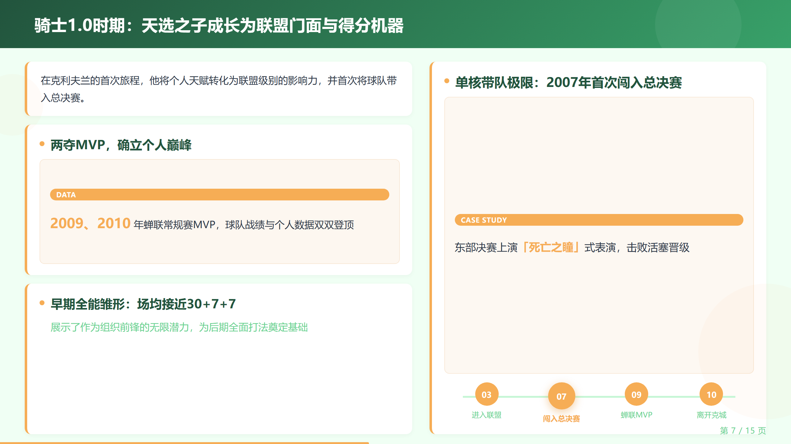
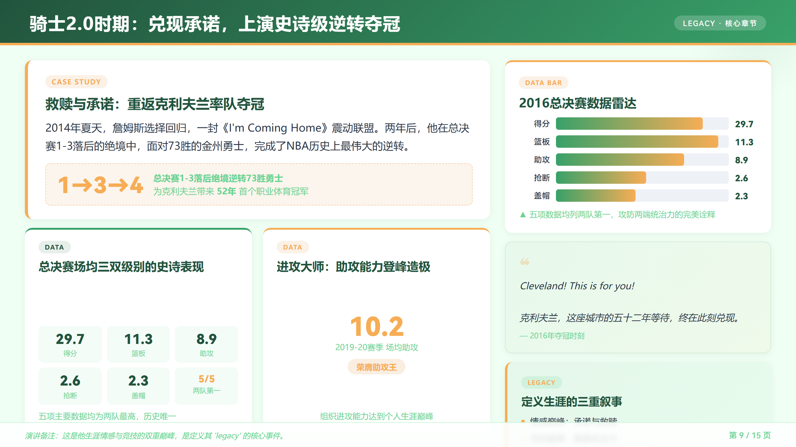
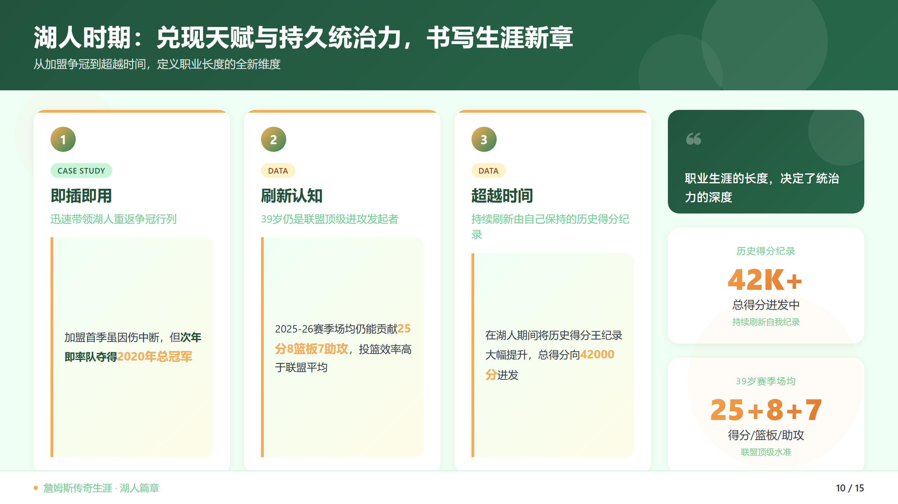
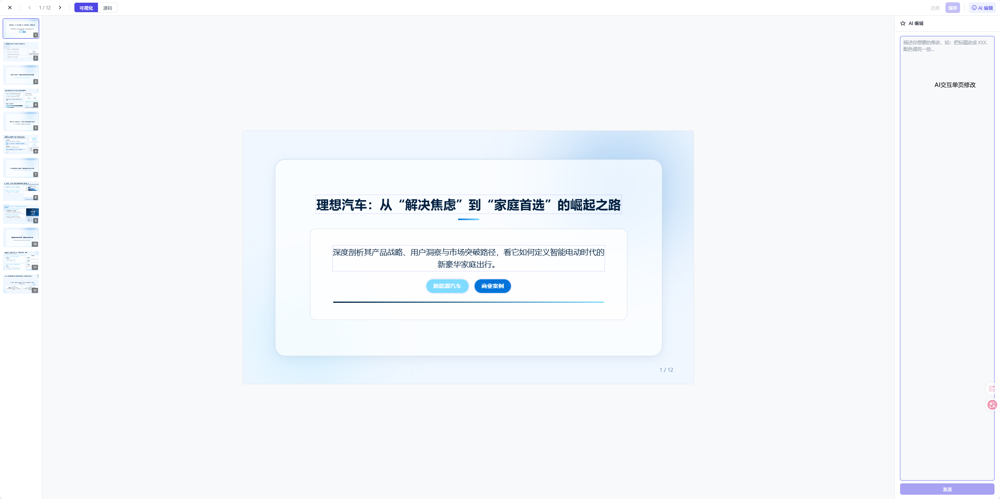
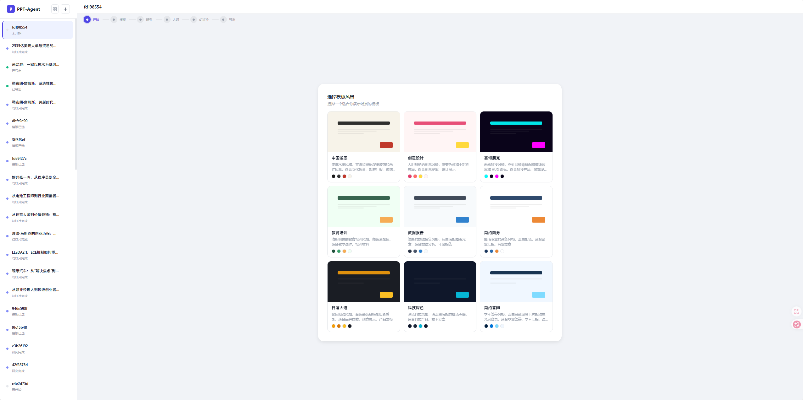

<h1 align="center">PPT-Agent</h1>

<p align="center">
  <strong>AI 驱动的 PPT 生成工具</strong><br>
  通过自然语言对话，自动完成主题研究 → 大纲设计 → 幻灯片制作，一键导出 PPTX
</p>

<p align="center">
  
</p>

<p align="center">
  <a href="#快速开始">快速开始</a> · <a href="#示例展示">示例展示</a> · <a href="#功能说明">功能说明</a> · <a href="#配置指南">配置指南</a>
</p>

---

## 示例展示

### 米哈游投资分析 · 16 页 · sunset 模板 · 快速模式

<p align="center">
  
  
  
</p>
<p align="center">
  
  
  
</p>

> PPTX 文件: [examples/](examples/)

### 勒布朗·詹姆斯传奇 · 15 页 · education 模板 · 快速模式

<p align="center">
  
  
  
</p>
<p align="center">
  
  
  
</p>

## 功能说明

### 生成流程

```
用户描述主题 → 确认需求 → [深度研究] → 生成大纲 → 选择模板 → 逐页生成幻灯片 → 预览 → 导出
```

- **需求确认**: AI 自动整理用户需求（页数、受众、核心信息等），展示后等待确认
- **深度研究**（可选）: 联网搜索多维度分析主题，生成研究笔记作为大纲素材
- **大纲生成**: 基于 SCQA 叙事框架，生成含论据层次的结构化大纲
- **幻灯片生成**: 逐页并发生成 HTML 幻灯片，每完成一页实时推送到前端预览
- **导出**: 支持 PPTX 下载

### 双模式

| | 快速模式 | 标准模式 |
|---|---|---|
| **流程** | 确认需求后自动完成所有步骤 | 每个步骤完成后暂停，等待确认 |
| **适合场景** | 信任 AI 判断，追求效率 | 需要逐步审核和调整 |
| **交互次数** | 仅需确认一次 | 研究、大纲各确认一次 |

### 双格式导出

| 格式 | 说明 |
|------|------|
| **可编辑 PPTX** | 文本、形状等元素可在 PowerPoint/WPS 中直接编辑 |
| **图片 PPTX** | 每页作为高清图片嵌入，排版还原度最高 |

### AI 编辑

在幻灯片编辑器中对任意一页进行 AI 交互修改：
- 打开编辑器 → 点击「AI 编辑」→ 输入修改指令（如"标题改为 XX"、"增加一段数据分析"）
- AI 生成修改预览，确认后保存

<p align="center">
  
</p>

### 文件导入

上传文档作为素材融入 PPT 生成：
- 支持格式: docx, xlsx, pdf, 图片等
- 自动解析为 Markdown，融入大纲生成过程
- 适合基于已有材料生成 PPT 的场景

### 内置模板

9 套精心设计的模板，覆盖常见场景：

| 模板 | 风格 | 适用场景 |
|------|------|----------|
| `simple_business` | 简约商务，蓝白配色 | 商务汇报、方案展示 |
| `tech_dark` | 科技深色，霓虹色 | 技术分享、产品发布 |
| `education` | 清新绿色 | 培训课件、教学演示 |
| `creative` | 渐变 + 不对称布局 | 创意提案、设计展示 |
| `report` | 灰白 + 图表元素 | 数据报告、年终总结 |
| `thesis_defense` | 蓝白毛玻璃 | 论文答辩、学术报告 |
| `sunset` | 暖色调 + 山脉剪影 | 投资分析、品牌故事 |
| `chinese_ink` | 宣纸纹理 + 水墨装饰 | 国风主题、文化展示 |
| `cyberpunk` | 网格 + 扫描线 + 霓虹 | 前沿科技、游戏主题 |

<p align="center">
  
</p>

## 快速开始

### 环境要求

- Python 3.11+
- Node.js 18+（Web 界面需要）
- [uv](https://docs.astral.sh/uv/)（Python 包管理）

### 安装

```bash
git clone https://github.com/SuTn/PPT-Agent.git
cd PPT-Agent

# 安装后端依赖
uv sync

# 安装浏览器引擎（用于幻灯片截图和可选的网页搜索）
uv run playwright install chromium
```

### 配置

```bash
cp .env.example .env
```

编辑 `.env`，至少配置一个 LLM 提供商。详细配置见下方 [配置指南](#配置指南)。

最简配置示例（使用 OpenAI）：

```env
PPT_AGENT_MODEL=openai:gpt-4o
PPT_AGENT_OPENAI_API_KEY=sk-your-key-here
```

### 启动

**Web 界面（推荐）:**

```bash
# 终端 1: 启动后端 API 服务
uv run ppt-agent-api

# 终端 2: 启动前端
cd web
npm install
npm run dev
```

打开 http://localhost:5173，选择模板、输入主题即可开始。

**CLI 模式:**

```bash
uv run ppt-agent
```

| 命令 | 说明 |
|------|------|
| `/new` | 新建会话 |
| `/upload` | 上传文件作为素材 |
| `/quit` | 退出 |

## 配置指南

### LLM 提供商

PPT-Agent 支持两种 API 接口格式，覆盖所有主流大模型服务商：

#### OpenAI 兼容接口

适用于 OpenAI、DeepSeek、通义千问、Moonshot、Ollama、vLLM 等：

```env
PPT_AGENT_MODEL=openai:gpt-4o              # 格式: openai:<模型名>
PPT_AGENT_OPENAI_API_KEY=sk-xxx            # API Key
PPT_AGENT_OPENAI_BASE_URL=                 # 非官方 OpenAI 需要填写 base_url
```

各服务配置示例：

```env
# DeepSeek
PPT_AGENT_MODEL=openai:deepseek-chat
PPT_AGENT_OPENAI_API_KEY=sk-xxx
PPT_AGENT_OPENAI_BASE_URL=https://api.deepseek.com/v1

# 通义千问
PPT_AGENT_MODEL=openai:qwen-plus
PPT_AGENT_OPENAI_API_KEY=sk-xxx
PPT_AGENT_OPENAI_BASE_URL=https://dashscope.aliyuncs.com/compatible-mode/v1

# Moonshot
PPT_AGENT_MODEL=openai:moonshot-v1-8k
PPT_AGENT_OPENAI_API_KEY=sk-xxx
PPT_AGENT_OPENAI_BASE_URL=https://api.moonshot.cn/v1

# Ollama（本地部署）
PPT_AGENT_MODEL=openai:qwen2.5:14b
PPT_AGENT_OPENAI_API_KEY=ollama            # 任意值即可
PPT_AGENT_OPENAI_BASE_URL=http://localhost:11434/v1
```

#### Anthropic 兼容接口

适用于 Anthropic Claude 及提供 Claude 接口的第三方服务：

```env
PPT_AGENT_MODEL=anthropic:claude-sonnet-4-6    # 格式: anthropic:<模型名>
PPT_AGENT_ANTHROPIC_API_KEY=sk-ant-xxx         # API Key
PPT_AGENT_ANTHROPIC_BASE_URL=                   # 第三方服务填写对应 base_url
```

### 联网搜索（可选）

配置后，AI 在研究阶段会自动搜索最新网络信息，提升内容时效性。不配置则仅依赖模型自身知识。

```env
PPT_AGENT_SEARCH_PROVIDER=tavily    # 搜索方式，见下方说明
```

**方式一: Tavily API（推荐）**

速度快（<2 秒），内容质量高，需要 API Key。

1. 前往 https://tavily.com 免费注册
2. 获取 API Key
3. 配置：

```env
PPT_AGENT_SEARCH_PROVIDER=tavily
PPT_AGENT_TAVILY_API_KEY=tvly-xxx          # 填入你的 Key
```

**方式二: Playwright 浏览器搜索**

无需 API Key，通过浏览器直接搜索。速度较慢（~10 秒/次），部分搜索引擎可能会拦截。

```env
PPT_AGENT_SEARCH_PROVIDER=playwright
```

**关闭搜索:**

```env
PPT_AGENT_SEARCH_PROVIDER=                 # 留空或不配置
```

### 并发配置

幻灯片生成采用并发处理，可通过环境变量调整并发数：

```env
PPT_AGENT_RESEARCH_CONCURRENCY=3     # 研究维度并发数（默认 3）
PPT_AGENT_SLIDE_CONCURRENCY=3        # 幻灯片生成并发数（默认 3）
PPT_AGENT_RENDER_CONCURRENCY=5       # 截图渲染并发数（默认 5）
```

## 技术栈

| 层 | 技术 |
|----|------|
| **Agent 框架** | [deepagents](https://github.com/langchain-ai/deepagents) + LangGraph |
| **LLM 接入** | LangChain (ChatOpenAI / ChatAnthropic) |
| **后端** | FastAPI, SSE 流式推送 |
| **前端** | Vue 3, TypeScript, Pinia, Vite |
| **幻灯片渲染** | HTML/CSS → Playwright 截图 → python-pptx |
| **持久化** | SQLite (对话历史), JSON (会话状态) |

## 路线图

- [ ] 自定义模板 — 导入自己的 PPT 模板，生成时自动适配
- [ ] 图表生成 — 根据数据自动生成柱状图、饼图等可视化图表
- [ ] 协作编辑 — 多人同时在线编辑同一份 PPT
- [ ] PPT 导入 — 上传已有 PPT，AI 分析并优化

欢迎提交 [Issue](https://github.com/SuTn/PPT-Agent/issues) 或 [PR](https://github.com/SuTn/PPT-Agent/pulls) 参与贡献。

## 测试

```bash
uv run pytest tests/ -v
```

## License

[MIT](LICENSE)
